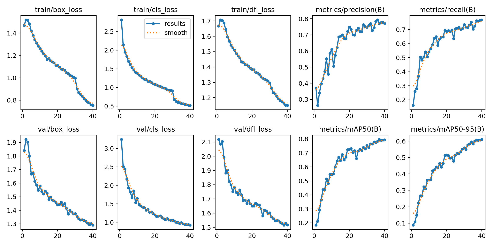
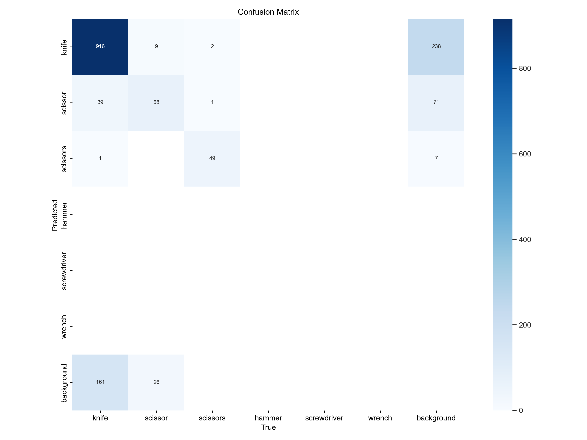
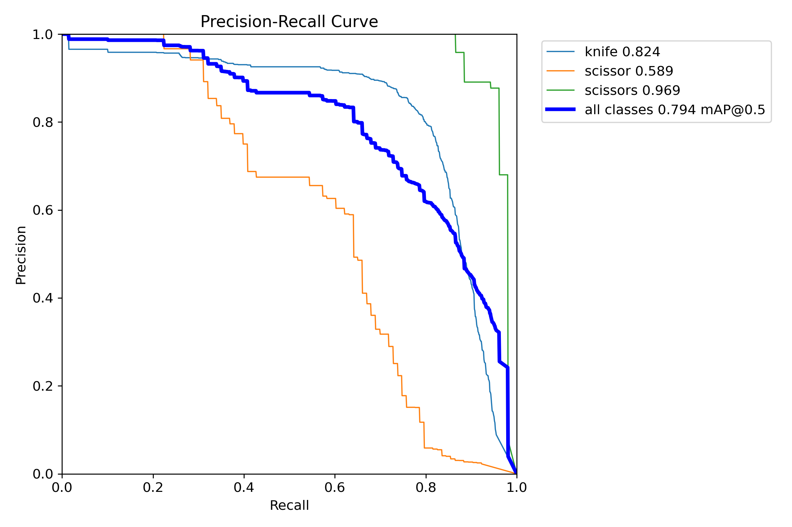
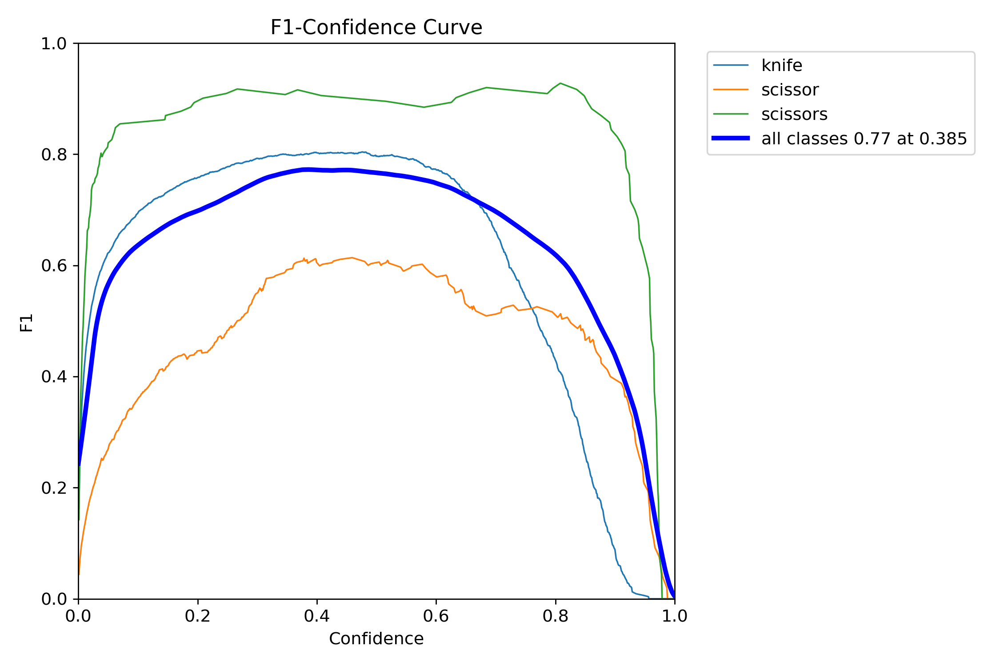
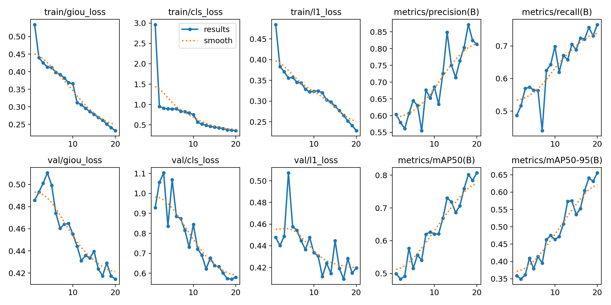
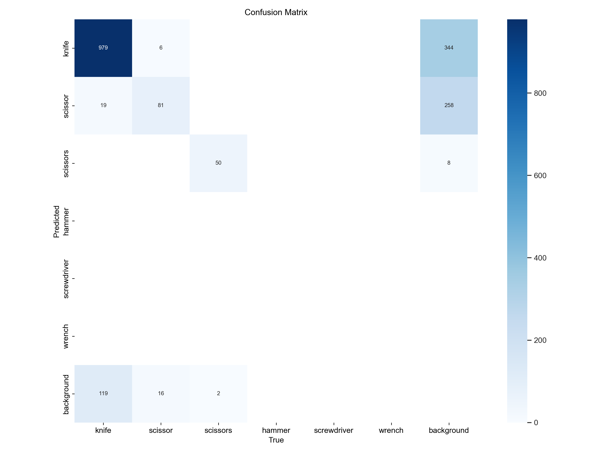
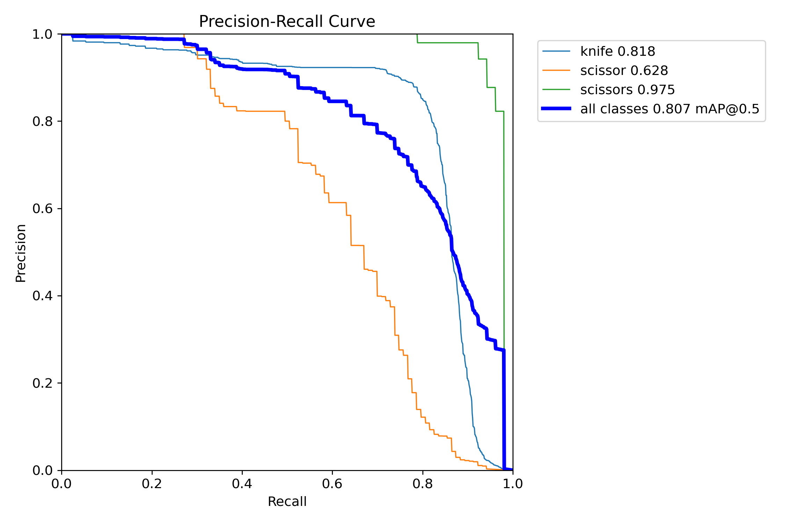
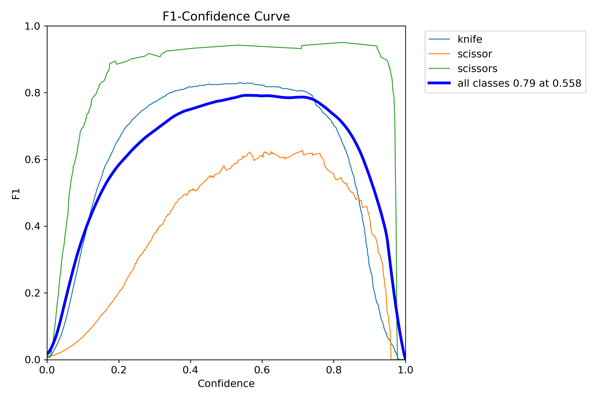

# VisionSecure AI - MVP de Detecao de Objetos Perigosos

MVP para deteccao de objetos perigosos (facas, bastoes, ferramentas de impacto e tesouras) em imagens e video (webcam), com geracao de alertas via webhook e e-mail. O sistema suporta dois modelos de deteccao: YOLO (YOLOv8) e RT-DETR.

## Sobre o Projeto

A VisionSecure AI e uma empresa especializada em monitoramento inteligente que busca aprimorar seus sistemas de seguranca utilizando inteligencia artificial. O objetivo e identificar em tempo real objetos potencialmente perigosos capturados por cameras de seguranca, alertando a central de monitoramento sobre situacoes de risco.

Este MVP (Minimum Viable Product) e capaz de identificar objetos perigosos em diferentes cenarios e gerar alertas automaticos.

### Funcionalidades

O sistema oferece deteccao automatizada de cinco classes de objetos perigosos: facas (knife), bastoes (bat), ferramentas de impacto (impact_tool), tesoura (scissor) e tesouras (scissors). Alem disso, possui um sistema de alertas automaticos via webhook e e-mail quando objetos perigosos sao detectados, suporte a deteccao em tempo real via webcam, e treinamento de modelo customizado com dataset proprio. O sistema permite escolher entre dois modelos de deteccao (YOLO ou RT-DETR) atraves de configuracao simples.

### Justificativa de Escolha dos Modelos

O projeto implementa dois modelos de deteccao de objetos com arquiteturas fundamentalmente diferentes, permitindo ao usuario escolher o mais adequado para seu caso de uso:

**YOLO (YOLOv8) - Arquitetura CNN**

O YOLO (You Only Look Once) e baseado em Redes Neurais Convolucionais (CNN). E um detector single-stage que processa a imagem inteira em uma unica passagem, resultando em alta velocidade de inferencia (~30+ FPS). Ideal para deteccao em tempo real via webcam onde a velocidade e prioritaria. O modelo YOLOv8n (nano) foi escolhido por ser uma versao leve adequada para prototipagem e execucao em hardware limitado.

**RT-DETR - Arquitetura Transformer**

O RT-DETR (Real-Time DEtection TRansformer) e baseado em mecanismos de atencao (Transformers), representando uma abordagem mais moderna para deteccao de objetos. E um modelo hibrido que combina CNN para extracao de features com Transformer para processamento. Nao requer NMS (Non-Maximum Suppression), simplificando o pipeline. Oferece maior precisao em cenarios complexos, porem com velocidade inferior (~5-10 FPS). Ideal quando a precisao e mais importante que a velocidade.

**Vantagem do Projeto**

Ambos os modelos utilizam o mesmo formato de dataset (formato YOLO com labels em arquivos .txt), permitindo reaproveitar completamente os dados de treinamento sem necessidade de conversao. Isso possibilita comparar facilmente o desempenho de arquiteturas CNN vs Transformer no mesmo conjunto de dados.

### Arquitetura

O projeto suporta duas arquiteturas de rede neural: YOLOv8n (CNN) para deteccao rapida em tempo real, e RT-DETR-l (Transformer) para maior precisao. O dataset contem aproximadamente 7.700 imagens distribuidas entre amostras positivas (contendo objetos perigosos) e negativas (sem objetos perigosos), garantindo robustez e reducao de falsos positivos.

## Estrutura do Projeto

```
visionsecure-mvp/
├── alerts.py               # envio de alertas (webhook + e-mail)
├── config.py               # leitura de config.yaml e .env
├── config.yaml             # arquivo de configuracao principal
├── config_example.yaml     # exemplo de configuracao
├── detection.py            # funcoes de deteccao e construcao de payload
├── train_yolo.py           # treinamento do modelo YOLO (CNN)
├── train_rtdetr.py         # treinamento do modelo RT-DETR (Transformer)
├── webcam_main.py          # loop principal da webcam (inferencia + alertas)
├── webhook_server.py       # servidor FastAPI para receber alertas
├── requirements.txt        # dependencias Python
├── .env.example            # exemplo de variaveis de ambiente
├── .gitignore              # arquivos ignorados pelo git
├── data/
│   ├── images/
│   │   ├── train/          # imagens de treino
│   │   └── val/            # imagens de validacao
│   ├── labels/
│   │   ├── train/          # labels YOLO de treino
│   │   └── val/            # labels YOLO de validacao
│   └── dataset.yaml        # definicao do dataset no formato YOLO
└── runs/
    ├── yolo/               # resultados de treinamento YOLO
    │   └── detectX/        # cada run gera uma pasta (detect, detect2, etc)
    │       └── weights/
    │           └── best.pt # melhor modelo YOLO treinado
    └── rtdetr/             # resultados de treinamento RT-DETR
        └── detectX/        # cada run gera uma pasta (detect, detect2, etc)
            └── weights/
                └── best.pt # melhor modelo RT-DETR treinado
```

## Configuracao do Ambiente (Windows 11)

### Pre-requisitos

Para executar este projeto voce precisara de Windows 11, Python 3.10 ou superior, Git (opcional, para clonar o repositorio), e opcionalmente uma GPU NVIDIA com drivers atualizados para acelerar o treinamento e inferencia.

### Passo 1: Instalar Python

Baixe o Python em https://www.python.org/downloads/windows/ e durante a instalacao marque a opcao "Add Python to PATH". Apos a instalacao, verifique se foi instalado corretamente abrindo o Prompt de Comando ou PowerShell e executando:

```bash
python --version
```

### Passo 2: Obter o Projeto

Voce pode clonar o repositorio usando Git:

```bash
git clone https://github.com/MatheusTalpe/TechChallenge05.git
cd TechChallenge05
```

Ou baixe o ZIP do projeto, extraia em uma pasta (por exemplo, `C:\TechChallenge05`) e abra o Prompt de Comando ou PowerShell nessa pasta.

### Passo 3: Criar Ambiente Virtual e Instalar Dependencias

No Prompt de Comando ou PowerShell, dentro da pasta do projeto, execute os seguintes comandos:

```bash
python -m venv .venv
.venv\Scripts\activate
pip install --upgrade pip
pip install -r requirements.txt
```

O arquivo `requirements.txt` ja inclui PyTorch com suporte a CUDA para GPUs NVIDIA. Se voce nao tiver uma GPU NVIDIA ou preferir treinar em CPU, altere `device: 0` para `device: cpu` no arquivo `config.yaml`.

### Passo 4: Configurar Variaveis de Ambiente

Copie o arquivo de exemplo e edite com suas credenciais:

```bash
copy .env.example .env
```

Abra o arquivo `.env` em um editor de texto e configure as credenciais de e-mail:

```
EMAIL_SMTP_SERVER=smtp.seuprovedor.com
EMAIL_SMTP_PORT=587
EMAIL_USE_TLS=true
EMAIL_USERNAME=seu_email@dominio.com
EMAIL_PASSWORD=sua_senha
EMAIL_FROM=alertas@visionsecure.ai
EMAIL_TO=destinatario@dominio.com
```

### Passo 5: Verificar config.yaml

O arquivo `config.yaml` ja vem configurado com valores padrao. Verifique se os caminhos e parametros estao corretos para seu ambiente. Se necessario, use `config_example.yaml` como referencia.

## Execucao Passo a Passo

### 1. Treinamento do Modelo

Antes de treinar, certifique-se de que existem imagens e labels nas pastas `data/images/train/`, `data/images/val/`, `data/labels/train/` e `data/labels/val/`.

**Opcao A: Treinamento com YOLO (CNN - Recomendado para tempo real)**

```bash
python train_yolo.py
```

O script ira treinar o modelo YOLOv8n com os parametros definidos em `config.yaml` (secao `train.yolo`), gerar graficos de metricas (perdas, mAP, precisao, recall), executar avaliacao final e exibir metricas de assertividade, e salvar o melhor modelo em `runs/yolo/detectX/weights/best.pt`.

**Opcao B: Treinamento com RT-DETR (Transformer - Maior precisao)**

```bash
python train_rtdetr.py
```

O script ira treinar o modelo RT-DETR-l com os parametros definidos em `config.yaml` (secao `train.rtdetr`), gerar graficos de metricas, executar avaliacao final, e salvar o melhor modelo em `runs/rtdetr/detectX/weights/best.pt`.

**Comparacao entre os modelos:**

| Caracteristica | YOLO (train_yolo.py) | RT-DETR (train_rtdetr.py) |
|----------------|----------------------|---------------------------|
| Arquitetura | CNN | Transformer |
| Velocidade | Rapido (~30+ FPS) | Mais lento (~5-10 FPS) |
| Precisao | Boa | Maior |
| Uso ideal | Tempo real | Precisao prioritaria |
| Modelo base | yolov8n.pt | rtdetr-l.pt |

### 2. Selecionar Modelo para Deteccao

Antes de executar a deteccao, configure qual modelo deseja usar editando o arquivo `config.yaml`:

```yaml
inference:
  # Tipo de modelo para deteccao: "yolo" ou "rtdetr"
  model_type: "yolo"  # Altere para "rtdetr" se preferir usar RT-DETR
```

O sistema ira automaticamente buscar o modelo treinado mais recente na pasta correspondente (`runs/yolo/` ou `runs/rtdetr/`).

### 3. Iniciar Servidor de Webhook (Opcional)

Em um terminal separado, inicie o servidor que recebera os alertas:

```bash
.venv\Scripts\activate
python webhook_server.py
```

O servidor FastAPI sera iniciado em `http://localhost:8000/alert` e salvara cada alerta recebido na pasta `alert_logs/`.

### 4. Deteccao em Tempo Real via Webcam

Em outro terminal, execute a deteccao:

```bash
.venv\Scripts\activate
python webcam_main.py
```

O script ira carregar o modelo selecionado (YOLO ou RT-DETR conforme configurado), abrir a webcam padrao, processar frames em tempo real detectando objetos perigosos, desenhar bounding boxes na janela de video, e enviar alertas via webhook e e-mail quando deteccoes persistentes forem identificadas.

Pressione `q` para encerrar a deteccao.

## Resumo dos Comandos

```bash
# Ativar ambiente virtual
.venv\Scripts\activate

# Treinar o modelo YOLO (CNN - rapido)
python train_yolo.py

# OU treinar o modelo RT-DETR (Transformer - maior precisao)
python train_rtdetr.py

# Servidor de alertas (em terminal separado)
python webhook_server.py

# Deteccao em tempo real via webcam
# (configure inference.model_type em config.yaml para escolher o modelo)
python webcam_main.py
```

## Metricas e Avaliacao

Apos o treinamento, o sistema exibe as seguintes metricas: mAP@0.50 (mean Average Precision), mAP@0.50:0.95, Precisao media, e Recall medio. O nivel de assertividade e classificado como ALTA (mAP >= 0.8), MEDIA (mAP >= 0.6) ou BAIXA (mAP < 0.6).

Os graficos gerados incluem `losses.png` (evolucao das perdas de treino/validacao), `map.png` (evolucao do mAP), e `precision_recall.png` (evolucao de precisao e recall).

## Sistema de Alertas

O sistema de alertas e acionado quando uma deteccao persiste por um numero minimo de frames consecutivos (configuravel em `alerts.min_persistent_frames`). Cada alerta contem timestamp, identificador da camera, lista de objetos detectados com classe, confianca e bounding box, nivel de severidade (alta para facas, media para outros), e caminho do frame salvo.

Os alertas sao enviados via webhook HTTP POST para a URL configurada e via e-mail SMTP para os destinatarios configurados.

## Classes Detectadas

O modelo detecta cinco classes de objetos perigosos: knife (faca) com severidade alta, bat (bastao) com severidade media, impact_tool (ferramenta de impacto como martelo, chave inglesa) com severidade media, scissor (tesoura) com severidade media, e scissors (tesouras) com severidade media.

## Requisitos de Hardware

Para treinamento recomenda-se GPU NVIDIA com pelo menos 4GB de VRAM, 16GB de RAM, e processador moderno (Intel i5/AMD Ryzen 5 ou superior). Para inferencia em tempo real, uma GPU e recomendada para melhor performance, mas o sistema tambem funciona em CPU.

## Solucao de Problemas

Se a webcam nao abrir, verifique se outra aplicacao esta usando a camera e se os drivers estao atualizados. Se ocorrer erro de memoria durante o treinamento, reduza o `batch` em `config.yaml` de 32 para 16 ou 8. Se os e-mails nao forem enviados, verifique as credenciais no arquivo `.env` e se o provedor permite acesso SMTP.

## Licenca

Este projeto foi desenvolvido como parte do Tech Challenge - Fase 5.

---

## Apresentacao de Resultados

### Visao Geral

O projeto VisionSecure AI tem como objetivo desenvolver um sistema de monitoramento inteligente capaz de identificar objetos potencialmente perigosos em tempo real atraves de cameras de seguranca. O sistema implementa duas arquiteturas de redes neurais: YOLO (CNN) e RT-DETR (Transformer), permitindo comparar abordagens tradicionais e modernas de deteccao de objetos.

### Comparativo dos Modelos Treinados

| Metrica | YOLO (CNN) | RT-DETR (Transformer) |
|---------|------------|----------------------|
| **mAP@0.50** | 79.4% | **80.7%** |
| **mAP@0.50-0.95** | **61.0%** | 65.6% |
| **Precisao** | 77.1% | **81.3%** |
| **Recall** | **76.9%** | 76.6% |
| **Epocas** | 40 | 20 |
| **Velocidade** | ~30+ FPS | ~5-10 FPS |
| **Nivel Assertividade** | MEDIA | ALTA |

O RT-DETR alcancou nivel de assertividade ALTA (mAP >= 80%) com apenas 20 epocas, enquanto o YOLO ficou proximo com 79.4% em 40 epocas. Ambos os modelos sao adequados para o MVP, com o YOLO sendo preferivel para tempo real e o RT-DETR para maior precisao.

---

### Resultados do Treinamento YOLO (CNN)

#### Configuracao do Treinamento YOLO

| Parametro | Valor |
|-----------|-------|
| Modelo Base | YOLOv8n (nano) |
| Arquitetura | CNN (Convolutional Neural Network) |
| Tamanho da Imagem | 640x640 pixels |
| Epocas | 40 |
| Batch Size | 8 |
| Patience (Early Stopping) | 10 |
| Workers | 0 (desabilitado para Windows) |
| AMP | Desabilitado |

#### Metricas Finais YOLO (Epoca 40)

| Metrica | Valor | Interpretacao |
|---------|-------|---------------|
| **mAP@0.50** | **79.4%** | Bom - Nivel de assertividade MEDIA |
| **mAP@0.50-0.95** | **61.0%** | Bom desempenho em diferentes limiares de IoU |
| **Precisao** | **77.1%** | Boa taxa de acertos nas deteccoes |
| **Recall** | **76.9%** | Boa capacidade de encontrar objetos |

#### Graficos de Treinamento YOLO

**Evolucao do Treinamento:**



**Matriz de Confusao YOLO:**



A matriz mostra que o modelo YOLO detecta bem a classe "knife" (916 acertos), mas apresenta 238 falsos positivos de background classificados como knife. As classes hammer, screwdriver e wrench nao possuem dados de treinamento.

**Curva Precision-Recall YOLO:**



**Curva F1-Confidence YOLO:**



---

### Resultados do Treinamento RT-DETR (Transformer)

#### Configuracao do Treinamento RT-DETR

| Parametro | Valor |
|-----------|-------|
| Modelo Base | RT-DETR-l (large) |
| Arquitetura | Transformer (mecanismos de atencao) |
| Tamanho da Imagem | 640x640 pixels |
| Epocas | 20 |
| Batch Size | 4 |
| Patience (Early Stopping) | 10 |
| Workers | 0 (desabilitado para Windows) |
| Plots | Desabilitado (para evitar erro de memoria) |

#### Metricas Finais RT-DETR (Epoca 20)

| Metrica | Valor | Interpretacao |
|---------|-------|---------------|
| **mAP@0.50** | **80.7%** | Excelente - Nivel de assertividade ALTA |
| **mAP@0.50-0.95** | **65.6%** | Muito bom desempenho em diferentes limiares |
| **Precisao** | **81.3%** | Alta taxa de acertos nas deteccoes |
| **Recall** | **76.6%** | Boa capacidade de encontrar objetos |

#### Graficos de Treinamento RT-DETR

**Evolucao do Treinamento:**



**Matriz de Confusao RT-DETR:**



**Curva Precision-Recall RT-DETR:**



**Curva F1-Confidence RT-DETR:**



---

### Distribuicao do Dataset


O dataset apresenta as seguintes caracteristicas:

**Distribuicao de Classes:** A classe "knife" possui ~7.000 instancias (classe dominante), enquanto "scissor" (~600) e "scissors" (~200) possuem menos amostras. As classes hammer, screwdriver e wrench nao possuem dados de treinamento no dataset atual.

**Distribuicao Espacial:** Os objetos aparecem predominantemente no centro das imagens, com boa variedade de tamanhos e proporcoes.

---

### Pontos Fortes dos Modelos

O YOLO oferece alta velocidade de inferencia (~30+ FPS), ideal para deteccao em tempo real via webcam. O RT-DETR oferece maior precisao (mAP 80.7%) com arquitetura moderna baseada em Transformers. Ambos os modelos apresentaram convergencia estavel durante o treinamento, e o sistema permite alternar facilmente entre os modelos via configuracao.

### Limitacoes Identificadas

O dataset apresenta desbalanceamento significativo, com predominancia da classe "knife". As classes hammer, screwdriver e wrench nao possuem dados de treinamento. Foram identificados falsos positivos (background classificado como knife) em ambos os modelos. O RT-DETR e mais lento, limitando seu uso em cenarios de tempo real.

### Recomendacoes para Melhoria

Para melhorar os modelos, recomenda-se balancear o dataset coletando mais imagens das classes sub-representadas, adicionar dados de treinamento para hammer, screwdriver e wrench, aplicar tecnicas de data augmentation para classes minoritarias, utilizar limiar de confianca de 0.5 para reduzir falsos positivos, e considerar o uso de modelos maiores (YOLOv8s ou YOLOv8m) para maior precisao.

### Conclusao

Os modelos treinados atendem aos requisitos do MVP da VisionSecure AI. O RT-DETR alcancou nivel de assertividade ALTA (mAP@0.50 = 80.7%), enquanto o YOLO ficou proximo com 79.4%. O sistema esta apto para deteccao em tempo real via webcam, geracao de alertas automaticos via webhook e e-mail, e integracao com sistemas de monitoramento existentes.

A escolha entre YOLO e RT-DETR depende do caso de uso: YOLO para tempo real com alta velocidade, RT-DETR para cenarios onde precisao e prioritaria.

### Arquivos de Referencia

**Resultados YOLO:**
- `runs/yolo/detect3/results.csv` - Metricas por epoca
- `runs/yolo/detect3/results.png` - Graficos de evolucao
- `runs/yolo/detect3/confusion_matrix.png` - Matriz de confusao
- `runs/yolo/detect3/weights/best.pt` - Modelo treinado

**Resultados RT-DETR:**
- `runs/rtdetr/detect3/results.csv` - Metricas por epoca
- `runs/rtdetr/detect3/results.png` - Graficos de evolucao
- `runs/rtdetr/detect3/confusion_matrix.png` - Matriz de confusao
- `runs/rtdetr/detect3/weights/best.pt` - Modelo treinado
