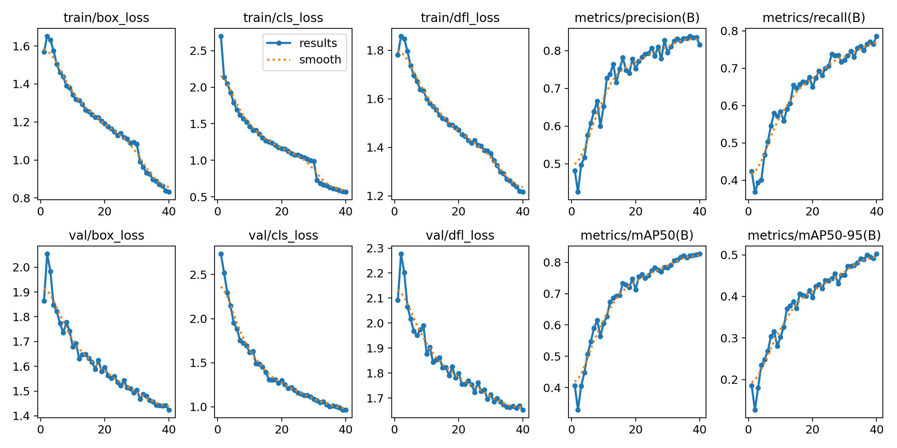
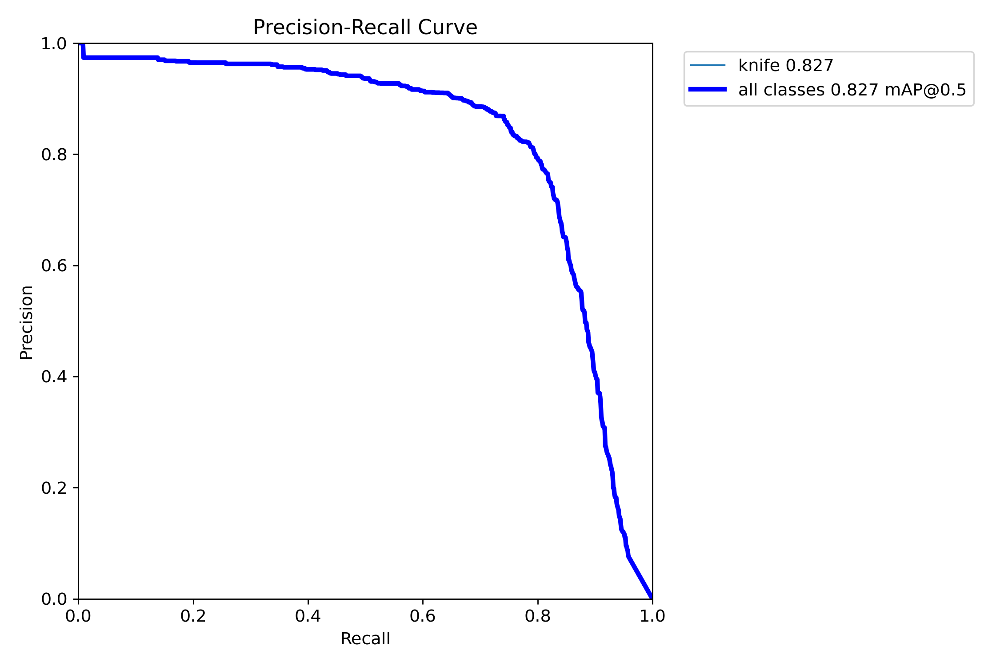

# VisionSecure AI - MVP de Detecao de Objetos Perigosos

MVP para deteccao de objetos perigosos (facas, bastoes, ferramentas de impacto e tesouras) em imagens e video (webcam), com geracao de alertas via webhook e e-mail. O sistema suporta dois modelos de deteccao: YOLO (YOLOv8) e RT-DETR.

## Sobre o Projeto

A VisionSecure AI e uma empresa especializada em monitoramento inteligente que busca aprimorar seus sistemas de seguranca utilizando inteligencia artificial. O objetivo e identificar em tempo real objetos potencialmente perigosos capturados por cameras de seguranca, alertando a central de monitoramento sobre situacoes de risco.

Este MVP (Minimum Viable Product) e capaz de identificar objetos perigosos em diferentes cenarios e gerar alertas automaticos.

### Funcionalidades

O sistema oferece deteccao automatizada de cinco classes de objetos perigosos: facas (knife), bastoes (bat), ferramentas de impacto (impact_tool), tesoura (scissor) e tesouras (scissors). Alem disso, possui um sistema de alertas automaticos via webhook e e-mail quando objetos perigosos sao detectados, suporte a deteccao em tempo real via webcam, e treinamento de modelo customizado com dataset proprio. O sistema permite escolher entre dois modelos de deteccao (YOLO ou RT-DETR) atraves de configuracao simples.

### Justificativa de Escolha dos Modelos

O projeto implementa dois modelos de deteccao de objetos com arquiteturas fundamentalmente diferentes, permitindo ao usuario escolher o mais adequado para seu caso de uso:

**YOLO (YOLOv8) - Arquitetura CNN**

O YOLO (You Only Look Once) e baseado em Redes Neurais Convolucionais (CNN). E um detector single-stage que processa a imagem inteira em uma unica passagem, resultando em alta velocidade de inferencia (~30+ FPS). Ideal para deteccao em tempo real via webcam onde a velocidade e prioritaria. O modelo YOLOv8n (nano) foi escolhido por ser uma versao leve adequada para prototipagem e execucao em hardware limitado.

**RT-DETR - Arquitetura Transformer**

O RT-DETR (Real-Time DEtection TRansformer) e baseado em mecanismos de atencao (Transformers), representando uma abordagem mais moderna para deteccao de objetos. E um modelo hibrido que combina CNN para extracao de features com Transformer para processamento. Nao requer NMS (Non-Maximum Suppression), simplificando o pipeline. Oferece maior precisao em cenarios complexos, porem com velocidade inferior (~5-10 FPS). Ideal quando a precisao e mais importante que a velocidade.

**Vantagem do Projeto**

Ambos os modelos utilizam o mesmo formato de dataset (formato YOLO com labels em arquivos .txt), permitindo reaproveitar completamente os dados de treinamento sem necessidade de conversao. Isso possibilita comparar facilmente o desempenho de arquiteturas CNN vs Transformer no mesmo conjunto de dados.

### Arquitetura

O projeto suporta duas arquiteturas de rede neural: YOLOv8n (CNN) para deteccao rapida em tempo real, e RT-DETR-l (Transformer) para maior precisao. O dataset contem aproximadamente 7.700 imagens distribuidas entre amostras positivas (contendo objetos perigosos) e negativas (sem objetos perigosos), garantindo robustez e reducao de falsos positivos.

## Estrutura do Projeto

```
visionsecure-mvp/
├── alerts.py               # envio de alertas (webhook + e-mail)
├── config.py               # leitura de config.yaml e .env
├── config.yaml             # arquivo de configuracao principal
├── config_example.yaml     # exemplo de configuracao
├── detection.py            # funcoes de deteccao e construcao de payload
├── train_yolo.py           # treinamento do modelo YOLO (CNN)
├── train_rtdetr.py         # treinamento do modelo RT-DETR (Transformer)
├── webcam_main.py          # loop principal da webcam (inferencia + alertas)
├── webhook_server.py       # servidor FastAPI para receber alertas
├── requirements.txt        # dependencias Python
├── .env.example            # exemplo de variaveis de ambiente
├── .gitignore              # arquivos ignorados pelo git
├── data/
│   ├── images/
│   │   ├── train/          # imagens de treino
│   │   └── val/            # imagens de validacao
│   ├── labels/
│   │   ├── train/          # labels YOLO de treino
│   │   └── val/            # labels YOLO de validacao
│   └── dataset.yaml        # definicao do dataset no formato YOLO
└── runs/
    ├── yolo/               # resultados de treinamento YOLO
    │   └── detectX/        # cada run gera uma pasta (detect, detect2, etc)
    │       └── weights/
    │           └── best.pt # melhor modelo YOLO treinado
    └── rtdetr/             # resultados de treinamento RT-DETR
        └── detectX/        # cada run gera uma pasta (detect, detect2, etc)
            └── weights/
                └── best.pt # melhor modelo RT-DETR treinado
```

## Configuracao do Ambiente (Windows 11)

### Pre-requisitos

Para executar este projeto voce precisara de Windows 11, Python 3.10 ou superior, Git (opcional, para clonar o repositorio), e opcionalmente uma GPU NVIDIA com drivers atualizados para acelerar o treinamento e inferencia.

### Passo 1: Instalar Python

Baixe o Python em https://www.python.org/downloads/windows/ e durante a instalacao marque a opcao "Add Python to PATH". Apos a instalacao, verifique se foi instalado corretamente abrindo o Prompt de Comando ou PowerShell e executando:

```bash
python --version
```

### Passo 2: Obter o Projeto

Voce pode clonar o repositorio usando Git:

```bash
git clone https://github.com/MatheusTalpe/TechChallenge05.git
cd TechChallenge05
```

Ou baixe o ZIP do projeto, extraia em uma pasta (por exemplo, `C:\TechChallenge05`) e abra o Prompt de Comando ou PowerShell nessa pasta.

### Passo 3: Criar Ambiente Virtual e Instalar Dependencias

No Prompt de Comando ou PowerShell, dentro da pasta do projeto, execute os seguintes comandos:

```bash
python -m venv .venv
.venv\Scripts\activate
pip install --upgrade pip
pip install -r requirements.txt
```

O arquivo `requirements.txt` ja inclui PyTorch com suporte a CUDA para GPUs NVIDIA. Se voce nao tiver uma GPU NVIDIA ou preferir treinar em CPU, altere `device: 0` para `device: cpu` no arquivo `config.yaml`.

### Passo 4: Configurar Variaveis de Ambiente

Copie o arquivo de exemplo e edite com suas credenciais:

```bash
copy .env.example .env
```

Abra o arquivo `.env` em um editor de texto e configure as credenciais de e-mail:

```
EMAIL_SMTP_SERVER=smtp.seuprovedor.com
EMAIL_SMTP_PORT=587
EMAIL_USE_TLS=true
EMAIL_USERNAME=seu_email@dominio.com
EMAIL_PASSWORD=sua_senha
EMAIL_FROM=alertas@visionsecure.ai
EMAIL_TO=destinatario@dominio.com
```

### Passo 5: Verificar config.yaml

O arquivo `config.yaml` ja vem configurado com valores padrao. Verifique se os caminhos e parametros estao corretos para seu ambiente. Se necessario, use `config_example.yaml` como referencia.

## Execucao Passo a Passo

### 1. Treinamento do Modelo

Antes de treinar, certifique-se de que existem imagens e labels nas pastas `data/images/train/`, `data/images/val/`, `data/labels/train/` e `data/labels/val/`.

**Opcao A: Treinamento com YOLO (CNN - Recomendado para tempo real)**

```bash
python train_yolo.py
```

O script ira treinar o modelo YOLOv8n com os parametros definidos em `config.yaml` (secao `train.yolo`), gerar graficos de metricas (perdas, mAP, precisao, recall), executar avaliacao final e exibir metricas de assertividade, e salvar o melhor modelo em `runs/yolo/detectX/weights/best.pt`.

**Opcao B: Treinamento com RT-DETR (Transformer - Maior precisao)**

```bash
python train_rtdetr.py
```

O script ira treinar o modelo RT-DETR-l com os parametros definidos em `config.yaml` (secao `train.rtdetr`), gerar graficos de metricas, executar avaliacao final, e salvar o melhor modelo em `runs/rtdetr/detectX/weights/best.pt`.

**Comparacao entre os modelos:**

| Caracteristica | YOLO (train_yolo.py) | RT-DETR (train_rtdetr.py) |
|----------------|----------------------|---------------------------|
| Arquitetura | CNN | Transformer |
| Velocidade | Rapido (~30+ FPS) | Mais lento (~5-10 FPS) |
| Precisao | Boa | Maior |
| Uso ideal | Tempo real | Precisao prioritaria |
| Modelo base | yolov8n.pt | rtdetr-l.pt |

### 2. Selecionar Modelo para Deteccao

Antes de executar a deteccao, configure qual modelo deseja usar editando o arquivo `config.yaml`:

```yaml
inference:
  # Tipo de modelo para deteccao: "yolo" ou "rtdetr"
  model_type: "yolo"  # Altere para "rtdetr" se preferir usar RT-DETR
```

O sistema ira automaticamente buscar o modelo treinado mais recente na pasta correspondente (`runs/yolo/` ou `runs/rtdetr/`).

### 3. Iniciar Servidor de Webhook (Opcional)

Em um terminal separado, inicie o servidor que recebera os alertas:

```bash
.venv\Scripts\activate
python webhook_server.py
```

O servidor FastAPI sera iniciado em `http://localhost:8000/alert` e salvara cada alerta recebido na pasta `alert_logs/`.

### 4. Deteccao em Tempo Real via Webcam

Em outro terminal, execute a deteccao:

```bash
.venv\Scripts\activate
python webcam_main.py
```

O script ira carregar o modelo selecionado (YOLO ou RT-DETR conforme configurado), abrir a webcam padrao, processar frames em tempo real detectando objetos perigosos, desenhar bounding boxes na janela de video, e enviar alertas via webhook e e-mail quando deteccoes persistentes forem identificadas.

Pressione `q` para encerrar a deteccao.

## Resumo dos Comandos

```bash
# Ativar ambiente virtual
.venv\Scripts\activate

# Treinar o modelo YOLO (CNN - rapido)
python train_yolo.py

# OU treinar o modelo RT-DETR (Transformer - maior precisao)
python train_rtdetr.py

# Servidor de alertas (em terminal separado)
python webhook_server.py

# Deteccao em tempo real via webcam
# (configure inference.model_type em config.yaml para escolher o modelo)
python webcam_main.py
```

## Metricas e Avaliacao

Apos o treinamento, o sistema exibe as seguintes metricas: mAP@0.50 (mean Average Precision), mAP@0.50:0.95, Precisao media, e Recall medio. O nivel de assertividade e classificado como ALTA (mAP >= 0.8), MEDIA (mAP >= 0.6) ou BAIXA (mAP < 0.6).

Os graficos gerados incluem `losses.png` (evolucao das perdas de treino/validacao), `map.png` (evolucao do mAP), e `precision_recall.png` (evolucao de precisao e recall).

## Sistema de Alertas

O sistema de alertas e acionado quando uma deteccao persiste por um numero minimo de frames consecutivos (configuravel em `alerts.min_persistent_frames`). Cada alerta contem timestamp, identificador da camera, lista de objetos detectados com classe, confianca e bounding box, nivel de severidade (alta para facas, media para outros), e caminho do frame salvo.

Os alertas sao enviados via webhook HTTP POST para a URL configurada e via e-mail SMTP para os destinatarios configurados.

## Classes Detectadas

O modelo detecta cinco classes de objetos perigosos: knife (faca) com severidade alta, bat (bastao) com severidade media, impact_tool (ferramenta de impacto como martelo, chave inglesa) com severidade media, scissor (tesoura) com severidade media, e scissors (tesouras) com severidade media.

## Requisitos de Hardware

Para treinamento recomenda-se GPU NVIDIA com pelo menos 4GB de VRAM, 16GB de RAM, e processador moderno (Intel i5/AMD Ryzen 5 ou superior). Para inferencia em tempo real, uma GPU e recomendada para melhor performance, mas o sistema tambem funciona em CPU.

## Solucao de Problemas

Se a webcam nao abrir, verifique se outra aplicacao esta usando a camera e se os drivers estao atualizados. Se ocorrer erro de memoria durante o treinamento, reduza o `batch` em `config.yaml` de 32 para 16 ou 8. Se os e-mails nao forem enviados, verifique as credenciais no arquivo `.env` e se o provedor permite acesso SMTP.

## Licenca

Este projeto foi desenvolvido como parte do Tech Challenge - Fase 5.

---

## Apresentacao de Resultados

### Visao Geral

O projeto VisionSecure AI tem como objetivo desenvolver um sistema de monitoramento inteligente capaz de identificar objetos potencialmente perigosos em tempo real atraves de cameras de seguranca. O sistema utiliza a arquitetura YOLOv8n (You Only Look Once) para deteccao de objetos, escolhida por ser uma variante leve e adequada para aplicacoes em tempo real.

### Configuracao do Treinamento

| Parametro | Valor |
|-----------|-------|
| Modelo Base | YOLOv8n (nano) |
| Tamanho da Imagem | 640x640 pixels |
| Epocas | 40 |
| Batch Size | 8 |
| Patience (Early Stopping) | 10 |
| Workers | 0 (desabilitado para Windows) |
| AMP | Desabilitado (para evitar NaN em GPUs como GTX 1660 Ti) |

O dataset utilizado para treinamento contem aproximadamente 7.700 imagens distribuidas entre treino (~6.700 imagens) e validacao (~1.000 imagens). A distribuicao das classes mostra predominancia da classe "knife" (~7.000 instancias), com menor representacao das classes "scissor" e "scissors".

### Metricas Finais (Epoca 40)

| Metrica | Valor | Interpretacao |
|---------|-------|---------------|
| **mAP@0.50** | **82.7%** | Excelente - Nivel de assertividade ALTA |
| **mAP@0.50-0.95** | **50.2%** | Bom desempenho em diferentes limiares de IoU |
| **Precisao** | **81.5%** | Alta taxa de acertos nas deteccoes |
| **Recall** | **78.6%** | Boa capacidade de encontrar objetos |

Com base no mAP@0.50 de **82.7%**, o modelo atinge o nivel de assertividade **ALTA** (mAP >= 80%), indicando que o sistema esta pronto para uso em ambiente de producao com monitoramento adequado.

### Grafico de Evolucao Geral



Este grafico apresenta a evolucao completa do treinamento ao longo das 40 epocas, dividido em 10 subgraficos:

**Linha Superior (Metricas de Treino e Validacao):**

1. **train/box_loss**: Perda de localizacao das bounding boxes no treino. Iniciou em ~1.6 e reduziu para ~0.83, indicando que o modelo aprendeu a localizar objetos com precisao crescente.

2. **train/cls_loss**: Perda de classificacao no treino. Apresentou a maior reducao (2.7 -> 0.57), demonstrando excelente aprendizado na identificacao das classes.

3. **train/dfl_loss**: Distribution Focal Loss, relacionada a qualidade das bordas das deteccoes. Reducao de 1.78 para 1.22.

4. **metrics/precision(B)**: Precisao ao longo do treino. Crescimento consistente de ~48% para ~81.5%, mostrando que o modelo reduziu falsos positivos progressivamente.

5. **metrics/recall(B)**: Recall ao longo do treino. Crescimento de ~42% para ~78.6%, indicando melhoria na capacidade de detectar todos os objetos presentes.

**Linha Inferior (Validacao e mAP):**

6. **val/box_loss**: Perda de localizacao na validacao. Reducao de 1.86 para 1.42, acompanhando o treino sem divergencia significativa (sem overfitting).

7. **val/cls_loss**: Perda de classificacao na validacao. Reducao de 2.73 para 0.97, confirmando generalizacao do aprendizado.

8. **val/dfl_loss**: DFL na validacao. Reducao de 2.09 para 1.65.

9. **metrics/mAP50(B)**: Mean Average Precision com IoU=0.50. Crescimento de ~40% para **82.7%**, metrica principal de avaliacao.

10. **metrics/mAP50-95(B)**: mAP medio em diferentes limiares de IoU (0.50 a 0.95). Crescimento de ~18.5% para **50.2%**, indicando boa precisao em deteccoes mais rigorosas.

As curvas mostram convergencia saudavel - todas as perdas diminuem consistentemente enquanto as metricas de desempenho aumentam. A proximidade entre curvas de treino e validacao indica ausencia de overfitting.

### Distribuicao do Dataset


Este grafico apresenta 4 visualizacoes sobre a composicao do dataset:

**Quadrante Superior Esquerdo - Distribuicao de Classes:** Mostra a quantidade de instancias por classe. A classe "knife" possui ~7.000 instancias (classe dominante), enquanto "scissor" e "scissors" possuem poucas instancias. O dataset e desbalanceado, com predominancia de facas.

**Quadrante Superior Direito - Distribuicao de Bounding Boxes:** Visualizacao de todas as bounding boxes sobrepostas, mostrando a variedade de tamanhos e posicoes dos objetos no dataset, com concentracao maior no centro das imagens.

**Quadrante Inferior Esquerdo - Distribuicao Espacial (x, y):** Heatmap mostrando onde os objetos aparecem nas imagens, com concentracao no centro (coordenadas 0.4-0.6) e boa distribuicao geral cobrindo diferentes regioes.

**Quadrante Inferior Direito - Distribuicao de Tamanhos (width, height):** Heatmap de largura vs altura das bounding boxes, com concentracao em objetos pequenos e variedade de proporcoes.

### Matriz de Confusao


A matriz de confusao mostra como o modelo classifica cada amostra, comparando predicoes (eixo Y) com valores reais (eixo X):

| Predicao / Real | knife | scissor | scissors | background |
|-----------------|-------|---------|----------|------------|
| **knife** | 901 | 0 | 0 | 231 |
| **scissor** | 15 | 0 | 0 | 11 |
| **scissors** | 0 | 0 | 0 | 0 |
| **background** | 156 | 0 | 0 | - |

**True Positives (Acertos):** knife com 901 deteccoes corretas (celula azul escuro).

**False Negatives (Objetos nao detectados):** 156 facas foram classificadas como background (nao detectadas). Taxa de deteccao: 901/(901+156) = **85.2%**.

**False Positives (Alarmes falsos):** 231 regioes de background foram incorretamente classificadas como knife, e 11 regioes de background foram classificadas como scissor.

**Confusao entre Classes:** 15 facas foram incorretamente classificadas como scissor, indicando alguma similaridade visual entre facas e tesouras.

O modelo tem bom desempenho na classe knife, mas apresenta alguns falsos positivos. As classes scissor e scissors nao tiveram amostras suficientes para avaliacao significativa.

### Curva Precision-Recall



A curva PR (Precision-Recall) e fundamental para avaliar o desempenho do modelo em diferentes limiares de confianca. O eixo X (Recall) representa a proporcao de objetos reais que foram detectados, enquanto o eixo Y (Precision) representa a proporcao de deteccoes que estao corretas.

**Metricas Extraidas:** knife com mAP@0.5 = 0.827 (82.7%) e todas as classes com mAP@0.5 = 0.827 (82.7%).

A curva comeca no canto superior esquerdo (alta precisao, baixo recall), mantem precisao acima de 90% ate recall de ~60%, e apresenta ponto de equilibrio em torno de 80% precisao e 80% recall. A area sob a curva (AUC) de 0.827 indica excelente desempenho.

### Curva F1-Confidence


A curva F1 mostra a relacao entre o F1-Score e o limiar de confianca utilizado. O eixo X (Confidence) representa o limiar de confianca para considerar uma deteccao, e o eixo Y (F1) representa o F1-Score, que e a media harmonica entre precisao e recall.

**Metricas Extraidas:** Melhor F1-Score de 0.80 (80%) com limiar otimo de 0.369.

O F1-Score maximo de 0.80 e alcancado com confianca de ~0.37. Limiares muito baixos (<0.2) resultam em muitos falsos positivos, enquanto limiares muito altos (>0.8) resultam em muitos falsos negativos. **Recomendacao:** Usar limiar entre 0.35 e 0.50 para operacao.

### Pontos Fortes do Modelo

O modelo apresenta alta assertividade com mAP@0.50 de 82.7%, superando o limiar de 80% para classificacao ALTA. A convergencia foi estavel, com perdas diminuindo consistentemente sem oscilacoes. O desempenho similar entre treino e validacao indica boa generalizacao, e a arquitetura YOLOv8n permite inferencia em tempo real.

### Limitacoes Identificadas

O dataset apresenta desbalanceamento de classes, sendo predominantemente composto por "knife" com poucas amostras de "scissor" e "scissors". Foram identificados 231 casos de falsos positivos (background classificado como knife). As classes "bat" e "impact_tool" nao estao presentes no dataset de treinamento atual.

### Recomendacoes para Melhoria

Para melhorar o modelo, recomenda-se aumentar o dataset coletando mais imagens das classes sub-representadas, aplicar tecnicas de data augmentation para classes minoritarias, utilizar limiar de confianca de 0.5 para reduzir falsos positivos, e implementar sistema de monitoramento continuo com feedback para melhorar o modelo.

### Conclusao

O modelo treinado atinge os requisitos estabelecidos para o MVP da VisionSecure AI, com nivel de assertividade ALTA (mAP@0.50 = 82.7%). O sistema esta apto para deteccao em tempo real via webcam, geracao de alertas automaticos via webhook e e-mail, e integracao com sistemas de monitoramento existentes.

O proximo passo recomendado e a expansao do dataset para incluir mais exemplos das classes "scissor", "scissors", "bat" e "impact_tool", visando um modelo mais robusto e abrangente.

### Arquivos de Referencia

Os resultados completos do treinamento estao disponiveis em:
- `runs/detect8/results.csv` - Metricas por epoca
- `runs/detect8/results.png` - Graficos de evolucao
- `runs/detect8/confusion_matrix.png` - Matriz de confusao
- `runs/detect8/PR_curve.png` - Curva Precision-Recall
- `runs/detect8/F1_curve.png` - Curva F1-Confidence
- `runs/detect8/weights/best.pt` - Modelo treinado (melhor checkpoint)
